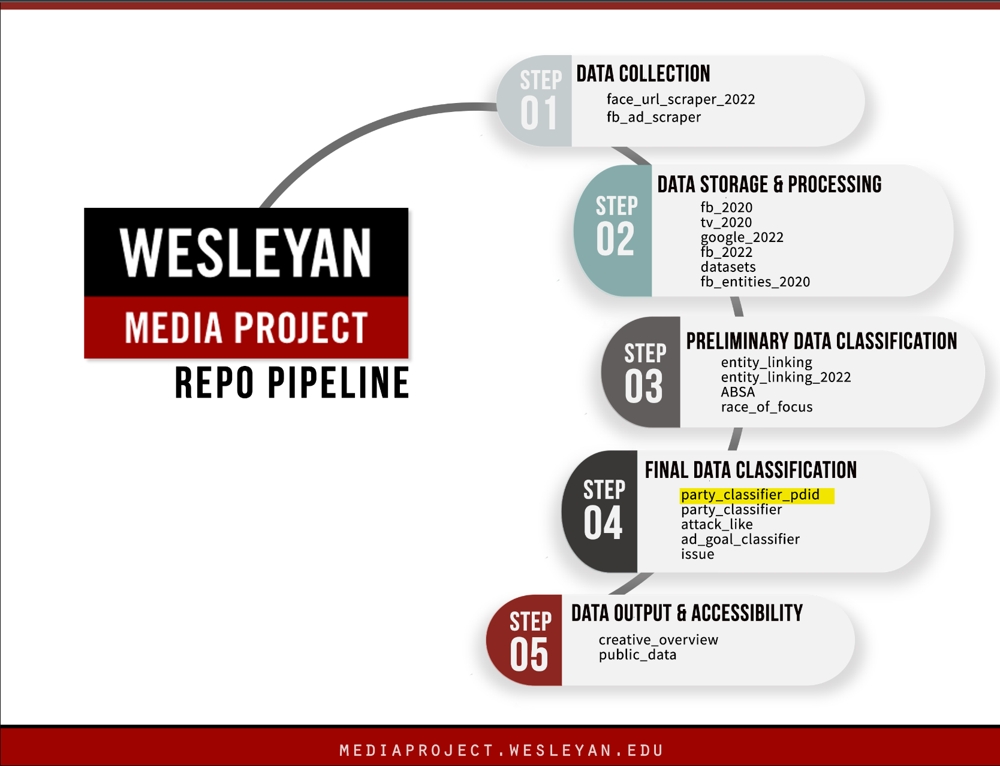

# Wesleyan Media Project - Party Classifier with Unique ID

Welcome! This repository contains scripts that train and apply a machine learning model to classify political advertisements based on their content and determine which political party (Democratic, Republican, or Other) the ads belong to.

This repo is a part of the [Cross-platform Election Advertising Transparency Initiative (CREATIVE)](https://www.creativewmp.com/). CREATIVE is an academic research project that has the goal of providing the public with analysis tools for more transparency of political ads across online platforms. In particular, CREATIVE provides cross-platform integration and standardization of political ads collected from Google and Facebook. CREATIVE is a joint project of the [Wesleyan Media Project (WMP)](https://mediaproject.wesleyan.edu/) and the [privacy-tech-lab](https://privacytechlab.org/) at [Wesleyan University](https://www.wesleyan.edu).

To analyze the different dimensions of political ad transparency we have developed an analysis pipeline. The scripts in this repo are part of the Data Classification Step in our pipeline. You will also need the repo [datasets](https://github.com/Wesleyan-Media-Project/datasets), [fb_2020](https://github.com/Wesleyan-Media-Project/fb_2020) and [data-post-production](https://github.com/Wesleyan-Media-Project/data-post-production) to run the scripts in this repo.



## Table of Contents

- [1. Overview](#1-overview)
  - [Model details](#model-details)
  - [Model performance](#model-performance)
- [2. Objective](#2-objective)
- [3. Setup](#3-setup)
- [4. Thank You](#4-thank-you)

## 1. Overview

The party classifier in this repo is trained using a Random Forest model, which is a machine learning algorithm that combines multiple decision trees to make predictions. The classifier is trained on the dataset of ads that have already been labeled with the party each ads belongs to.

Unlike [the ad-level party classifiers](https://github.com/Wesleyan-Media-Project/party_classifier) that operate at the individual ad level, this classifier works at the entity level by analyzing all ads associated with a particular entity ["pd_id"](https://github.com/Wesleyan-Media-Project/fb_pd_id) collectively.

In situations where you need clear and specific predictions about political party affiliations for ads, it's better to use this classifier instead of the [ad-level one](https://github.com/Wesleyan-Media-Project/party_classifier). This is because this party classifier operates under the assumption that all ads associated with a single pd_id will belong to the same party, leading to more consistent and potentially more accurate predictions about party affiliation when viewing the ads collectively rather than individually

The script `01_create_training_data.ipynb` prepares a training dataset by first  reading the ad data `fb_2020_140m_adid_var1.csv.gz` and merges it with the WMP entity file `wmp_fb_entities_v090622.csv` based on the pd_id column. This allows the script to associate each ad with a party affiliation. Second, the script checks for each page ID (page_id) and ensure all associated ads has consistent party affiliations across. If a page ID has ads with conflicting party affiliations, it marks that page ID as non-usable. Third, the script split page names into train and test with a 70/30 split to make sure pd ids of a usable page into either train or test but never both. Finally, the script  prepare text for train, test, and inference by filtering out the rows with non-usable page IDs and saving the resulting data frame as a compressed CSV file: `140m_with_page_id_based_training_data.csv.gz`. This file contains the ad data, page IDs, party affiliations, and the train-test split information for the usable page IDs and is located in the `/data/facebook` folder.

The script `02_training.ipynb` then loads the training data and trains the party classifier model. During the training process, the script trains the following machine learning models and pick the best model Random Forest based on classification reports:

- Multinomial Naive Bayes (MultinomialNB)
- Logistic Regression
- Support Vector Machine (SVM)
- Random Forest

All models are saved in the `/models` folder. The best model that later used to inference the new data is  `party_clf_pdid_rf.joblib`.

### Model details

The best-performing model is identified as the Random Forest Classifier with the following hyperparameters we found using Grid Search Cross-Validation:

- 'clfmax_depth': 25,
- 'clfmax_features': 0.1,
- 'clf\_\_n_estimators': 500

### Model performance

Here is the model performance on held-out test set:

```
              precision    recall  f1-score   support

         DEM      0.843     0.941     0.889       491
       OTHER      1.000     0.091     0.167        44
         REP      0.887     0.851     0.869       424

    accuracy                          0.862       959
   macro avg      0.910     0.628     0.642       959
weighted avg      0.870     0.862     0.847       959
```

After the training, the following scripts `03_google2022_inference.ipynb`, `03_inference_140m.ipynb` and `03_inference_fb2022.ipynb` are all used to apply the trained model to different datasets. The applied output is saved accordingly in the file `party_all_clf_google_2022_advertiser_id.csv`, `party_all_clf_pdid_fb_2020_140m.csv`, and `party_all_clf_pdid_fb_2022.csv`

## 2. Objective

Each of our repos belongs to one or more of the following categories:

- Data Collection
- Data Processing
- Data Classification
- Compiled Final Data

This repo is part of the Data Classification section.

## 3. Setup

To start setting up the repo and run the scripts, first clone this repo to your local directory:
  
  ```bash
  git clone https://github.com/Wesleyan-Media-Project/party_classifier_pdid.git
  ```

Then, ensure you have the following software packages installed:

- `scikit-learn`
- `pandas`
- `numpy`
- `joblib`

You can install the required packages by running the following command:
  
  ```bash
  pip install pandas numpy scikit-learn joblib
  ```

After installing the required packages, you can run the scripts in the following order:

1. `01_create_training_data.ipynb`
2. `02_training.ipynb`
3. `03_google2022_inference.ipynb`, `03_inference_140m.ipynb`, or `03_inference_fb2022.ipynb`

However, since the outputs of each script are saved in this repo, you can also run the scripts in any order by your preference. For example, you can only run the inference script since the model files are already present in the `/models` folder.

## 4. Thank You

<p align="center"><strong>We would like to thank our financial supporters!</strong></p><br>

<p align="center">This material is based upon work supported by the National Science Foundation under Grant Numbers 2235006, 2235007, and 2235008.</p>

<p align="center" style="display: flex; justify-content: center; align-items: center;">
  <a href="https://www.nsf.gov/awardsearch/showAward?AWD_ID=2235006">
    
  </a>
</p>

<p align="center">The Cross-Platform Election Advertising Transparency Initiative (CREATIVE) is a joint infrastructure project of the Wesleyan Media Project and privacy-tech-lab at Wesleyan University in Connecticut.

<p align="center" style="display: flex; justify-content: center; align-items: center;">
  <a href="https://www.creativewmp.com/">
    
  </a>
</p>

<p align="center" style="display: flex; justify-content: center; align-items: center;">
  <a href="https://mediaproject.wesleyan.edu/">
    
  </a>
</p>

<p align="center" style="display: flex; justify-content: center; align-items: center;">
  <a href="https://privacytechlab.org/" style="margin-right: 20px;">
    
  </a>
</p>
